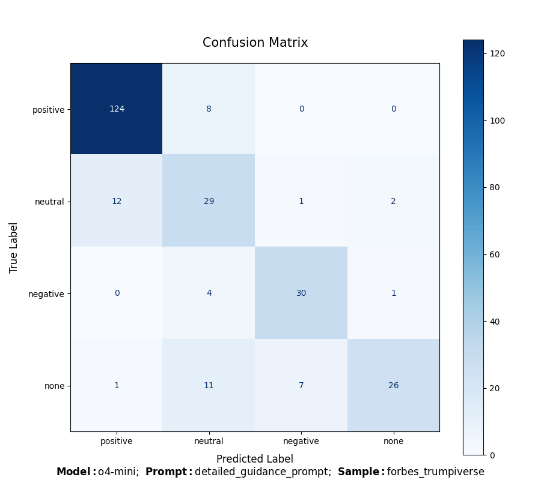

# Entity Relation Annotator

This repository provides a tool for automatically labeling the relationship between two entities in a given sentence using models from the OpenAI API. It takes a CSV file as input, containing sentences along with pre-annotated entity pairs, and returns an updated CSV file with predicted relationship labels. Progress is logged in the terminal throughout the process.

If ground truth labels are provided, the tool can also compute evaluation metrics such as accuracy and Krippendorff’s alpha to assess intercoder reliability. It generates a confusion matrix to visualize model performance and saves all evaluation results to file, enabling easy comparison between different combinations of prompts, models, and datasets.

## Table of Contents

- [Features](#features)
- [Project Structure](#project-structure)
- [Requirements](#requirements)
- [Setup](#setup)
- [Usage](#usage)
- [Output Format](#output-format)
- [Evaluation Metrics](#evaluation-metrics)
- [Example](#example)
- [Known Issues and Problems with the API](#known-issues-and-problems-with-the-api)

## Features

- **Batch Processing:** Efficiently processes sentences in batches.
- **Relationship Categorization:** Detects and categorizes relationships using predefined categories:
  - Positive
  - Neutral
  - Negative
  - None (no relationship detected)
- **CSV Output:** Exports the labeled data in CSV format.
- **Logging**: Logs progress in the terminal.
- **Evaluation Metrics:** Generates confusion matrices and calculates key performance metrics (accuracy, Krippendorff’s Alpha, and Brennan-Prediger’s Alpha) to assess model performance.

## Project Structure

```plaintext
├── data
│   ├── api_output/               # OpenAI-labeled output files
│   ├── evaluation/
│   │   ├── confusion_matrices/   # Confusion matrix plots for analysis
│   │   └── evaluation.csv        # Evaluation metrics/results
│   └── samples/                  # Sampled input sentences for labeling
│
├── prompts/                      # Prompt templates used with the API
│
├── scripts/
│   ├── evaluate_output.R         # Evaluates model output vs ground truth
│   ├── generate_samples.R        # Create samples from labeled data
│   ├── helper_functions.py       # Utility functions
│   └── run.py                    # Main script to run API labeling
│
├── .env                          # Environment variables (OpenAI API key)
├── .gitignore                    # Files to ignore in version control
├── requirements.txt              # Python dependencies
└── README.md                     # This file
```

## Requirements

- **Python:** Version 3.13 or later.

  Needed packages are listed in `requirements.txt`.

- **R** (only needed for creating samples and further evaluating the output files)

  Needed packages are: `tidyr`, `ggplot2`, `gridExtra` and `grid`.

- **OpenAI API Access**

  Obtain an API key from the [OpenAI API Platform](https://platform.openai.com/api-keys).

## Setup

1. **Clone the Repository**

```bash
git clone https://github.com/michael-duer/openai-data-labeling.git
cd openai-data-labeling
```

2. **Install Python Dependencies**

```bash
 python3 -m pip install -r requirements.txt
```

3. **Configure API Key**

   Rename the provided `.env.example` file to `.env` and replace the placeholder with your actual OpenAI API key:

```env
OPENAI_API_KEY = your_openai_api_key
```

## Usage

### 1. Prepare Input Data

Place a CSV file in the `data/samples/` folder. The file **must** include the following columns:

- `sentence`: The full sentence containing two entities.
- `head`: The first named entity.
- `tail`: The second named entity.

If ground truth is available, also include:

- `rel_head_tail`: The true relationship from head to tail.
- `rel_tail_head`: The true relationship from tail to head.

You can use the provided sample files for reference.

### 2. Configure the Script

Open `scripts/run.py` and adjust the parameters passed to the `process_and_evaluate_files()` function:

- **model_id**: The OpenAI model identifier (e.g., `gpt-4-turbo`).
- **system_prompt_file**: The name of the prompt file (located in the `prompts/` folder).
- **input_file**: The name of the CSV file (located in the `data/samples/` folder).
- **batch_size**: Number of rows per prompt batch (adjust to fit the model’s token limit).
- **override**: Whether to overwrite existing outputs (`True`) or skip them (`False`).

The tool uses both the system prompt (from file) and a `base_prompt` with static instructions defined in `scripts/helper_functions.py`.

### 3. Run the Labeling Process

In your terminal, change into the scripts folder and execute the `run.py` file:

```bash
 cd scripts
 python run.py # or python3 run.py on linux/unix
```

### 4. Output

The results will be saved to the `data/api_output/` directory in two files:

- `output_{model}_{prompt}_{sample}.csv`
- `detailed_output_{model}_{prompt}_{sample}.csv`

The output CSV files include:

- `sentence`: The original sentence.
- `head`: First named entity.
- `tail`: Second named entity.
- `relation_predicted_head_tail`: Predicted Relationship from entity head to tail.
- `relation_predicted_tail_head`: Predicted Relationship from entity tail to head.
- `relation_true_head_tail`: True relationship from head to tail (if available).
- `relation_true_tail_head`: True relationship from tail to head (if available).

The detailed output file additionally also contains the following two columns:

- `correct_head_tail`: Indicates if the relationship from head to tail matches.
- `correct_tail_head`: Indicates if the relationship from tail to head matches.

## Evaluation Metrics

The evaluation file contains:

- **Dataset Details**:
  - Sample file name and size.
  - Model and prompt used.
- **Performance Metrics**:
  - Accuracy
  - Krippendorff’s Alpha
  - Brennan-Prediger’s Alpha

These metrics help compare different models and prompt configurations.

## Example

In the example below, we use a sample CSV based on a Forbes article about Donald Trump, combined with the currently best-performing prompt. We use the `o4-mini` model for labeling.

### Input

**Sentences to label**: `data/samples/forbes_trumpiverse.csv`

Below is a snippet of the input CSV file. Each row contains a sentence, two named entities (`head` and `tail`), and the ground truth relationship between them in both directions.

| sentence                                                                                     | head      | tail  | rel_head_tail | rel_tail_head |
| -------------------------------------------------------------------------------------------- | --------- | ----- | ------------- | ------------- |
| The world’s richest man spent over \$200 million to get Trump elected, and his Department... | Elon Musk | Trump | positive      | positive      |

**Prompt file**: `prompts/detailed_guidance_prompt.txt`

### Output

#### Terminal Output

```bash
------------------------------------------------------------
[START] Processing: forbes_trumpiverse.csv

Processing batches: 100%|████████████████████████████████████████████████████████████████████████████████████████████████████████| 3/3 [03:56<00:00, 78.81s/it]
Results saved to: ../data/api_output/output_o4-mini_detailed_guidance_prompt_forbes_trumpiverse.csv

Evaluation Summary

Input file         : forbes_trumpiverse.csv
Number of sentences: 128
Model              : o4-mini
Prompt             : detailed_guidance_prompt.txt

┏━━━━━━━━━━━━━━━━━━━━━━━━━━━━━━━━━━━━━━━━━━━━━━━━━━━━━━━━┓
┃ Metric                   ┃                       Value ┃
┣━━━━━━━━━━━━━━━━━━━━━━━━━━━━━━━━━━━━━━━━━━━━━━━━━━━━━━━━┫
┃ Correct Predictions      ┃                         209 ┃
┃ Incorrect Predictions    ┃                          47 ┃
┃ Accuracy                 ┃                      81.64% ┃
┃ Krippendorff’s Alpha     ┃                       0.717 ┃
┃ BP Alpha                 ┃                       0.755 ┃
┗━━━━━━━━━━━━━━━━━━━━━━━━━━━━━━━━━━━━━━━━━━━━━━━━━━━━━━━━┛

[END] Finished processing file 1 of 1.
------------------------------------------------------------
```

#### Generated Files

After running the script, the following files are generated:

##### `data/api_output/output_o4-mini_detailed_guidance_prompt_forbes_trumpiverse.csv`

This file contains the labeled relationships for each sentence in both directions, along with the ground truth (if available).

**Preview:**

| sentence                                                                                     | head      | tail  | relation_predicted_head_tail | relation_predicted_tail_head | relation_true_head_tail | relation_true_tail_head |
| -------------------------------------------------------------------------------------------- | --------- | ----- | ---------------------------- | ---------------------------- | ----------------------- | ----------------------- |
| The world’s richest man spent over \$200 million to get Trump elected, and his Department... | Elon Musk | Trump | positive                     | positive                     | positive                | positive                |

---

##### `data/api_output/detailed_output_o4-mini_detailed_guidance_prompt_forbes_trumpiverse.csv`

This extended version includes correctness flags for both relationship directions.

**Preview:**

| sentence                                                                                     | head      | tail  | relation_predicted_head_tail | relation_true_head_tail | correct_head_tail | relation_predicted_tail_head | relation_true_tail_head | correct_tail_head |
| -------------------------------------------------------------------------------------------- | --------- | ----- | ---------------------------- | ----------------------- | ----------------- | ---------------------------- | ----------------------- | ----------------- |
| The world’s richest man spent over \$200 million to get Trump elected, and his Department... | Elon Musk | Trump | positive                     | positive                | True              | positive                     | positive                | True              |

---

##### `data/evaluation/confusion_matrices/cm_o4-mini_detailed_guidance_prompt_forbes_trumpiverse.png`

A visual summary of model performance.



---

##### `data/evaluation/evaluation.csv`

Each run appends a row with performance metrics for later comparison.

**Preview:**

| dataset                | sample_size | model   | prompt                       | accuracy | krippendorff_alpha | bp_alpha |
| ---------------------- | ----------- | ------- | ---------------------------- | -------- | ------------------ | -------- |
| forbes_trumpiverse.csv | 128         | o4-mini | detailed_guidance_prompt.txt | 81.64    | 0.7171             | 0.7552   |

## Known Issues and Problems with the API

- **Non-deterministic Output:**
  Even with `temperature=0` and fixed parameters, OpenAI models can produce slightly different outputs for the same input. To mitigate this, you may run multiple iterations and either average the results or apply a majority voting strategy (see the WIP branch `majority-voting`).

- **Incomplete or Partial Responses**  
  Occasionally, the API returns fewer outputs than expected without any explicit error. This can typically be resolved by re-running the script. If the issue persists, it is likely due to exceeding the model’s context window. Reducing the batch size or switching to a model with a larger context window often resolves the problem.

- **Parsing Errors (e.g., "Failed to parse API response")**  
  This error usually occurs when the API response is not valid JSON, often due to truncation or malformed output. This may also stem from exceeding token limits. As above, retrying with a smaller batch size or a model with a larger context window generally resolves the issue.

- **Batch Size Sensitivity:**
  Large batch sizes can lead to truncated responses or degraded output quality, especially with models that have smaller context windows (e.g., `gpt-3.5-turbo`). Experiment with batch sizes that fit within the model's token limit.

- **Performance Degradation on Large Jobs:**
  Labeling a large number of files or long sentences in a single run can lead to degraded performance, incomplete results, or API rate limiting. For example, processing 10 files each containing 50 sentences has been tested successfully. Processing two files with 500 sentences each also works fine with most models (except for `gpt-3.5-turbo` due to the smaller context window). If you encounter issues, try processing fewer files at a time.
